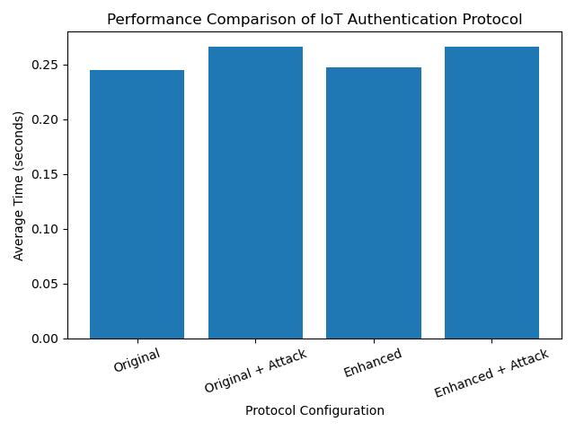

#  ECC-Based IoT Authentication Protocol

A secure and lightweight authentication protocol for IoT environments based on **Elliptic Curve Cryptography (ECC)**.  
This project implements **mutual authentication, session key establishment, attack resistance, and performance benchmarking**, along with **adaptive trust-based enhancements**.

---

# Overview

IoT devices are highly vulnerable to attacks due to limited resources and insecure communication channels.  
This project implements a **secure ECC-based authentication protocol** between:

- Sensor (IoT device)
- Server (Gateway)
- Trusted Authority (TA)

The protocol ensures:

- Secure identity verification
- Session key establishment
- Resistance to multiple attacks
- Lightweight computation for IoT systems

---

#  System Architecture

### 🔹 Trusted Authority (TA)
- Registers devices
- Generates cryptographic credentials
- Distributes authentication tokens

### 🔹 Sensor (IoT Device)
- Initiates authentication
- Generates authentication request
- Verifies server response
- Updates authentication tokens

### 🔹 Server (Gateway)
- Verifies sensor identity
- Generates response
- Establishes secure session

---

#  Protocol Phases

## 1️⃣ Registration Phase (R1–R4)

- Sensor and Server register with TA
- Receive:
  - Identity (ID)
  - Private key
  - Public key
  - Initial authentication token (TCssp)
- Compute Trusted Witness:
WT = k · PK

---

## 2️⃣ Authentication Phase (A1–A4)

### A1 — Sensor Request
A_s = x_s · PK_s
ETCssp = TCssp ⊕ h(A_s, WT_s)
Vs1 = h(ID_s, TCssp, A_s, WT_s)

### A2 — Server Verification
- Recovers TC
- Verifies integrity and authenticity

### A3 — Server Response
A_sp = x_sp · PK_sp
V_sp = h(WT_sp, ID_s, TC_new, A_sp, SSK)

### A4 — Sensor Verification
- Validates server response
- Establishes session key

---

# 🔑 Session Key Establishment

Both sides independently compute:
Sensor: SK = x_s · (k_s · A_sp)
Server: SK = x_sp · (k_sp · A_s)

✔ Due to ECC properties → same shared key

---

# 🔄 Token Update Mechanism
TC_new = TC_old ⊕ h(SK, A_sp)

✔ Prevents replay attacks  
✔ Ensures forward secrecy  

---

# 🔁 Resynchronization Mechanism

If token mismatch occurs:

- Sensor sends recovery request
- Server restores correct token
- System resumes without re-registration

---

# 🛡️ Security Features

| Attack | Protection |
|------|----------|
| Replay Attack | Dynamic token update |
| Impersonation | Hash verification |
| MITM Attack | ECC key agreement |
| Desynchronization | Resync protocol |
| Expired Session | Time-bound validation |

---

# 🚀 Novel Enhancements

This implementation extends the original protocol with:

### ✅ Adaptive Trust Score
- Increases on success
- Decreases on failure

### ✅ Time-Bound Authentication
- Prevents expired session reuse

### ✅ Device Lock Mechanism
- Blocks compromised devices

### ✅ Trust Decay
- Reduces trust over inactivity

---

# 📊 Performance Evaluation

Four configurations tested:

| Mode | Description |
|------|------------|
| Original | Base protocol |
| Original + Attack | Attack overhead |
| Enhanced | Trust + expiry |
| Enhanced + Attack | Full system |

### Key Observation:
> Security enhancements introduce **negligible computational overhead** compared to ECC operations.

---

# 📈 Example Output
===== PERFORMANCE COMPARISON =====

Original → 0.246 sec
Original + Attack → 0.269 sec
Enhanced → 0.248 sec
Enhanced + Attack → 0.261 sec

---

# 📊 Performance Graph

The following graph compares execution time across four configurations:

- Original protocol
- Original with attack simulation
- Enhanced protocol
- Enhanced with attack simulation



### 📌 Analysis

The results show that:

- ECC operations dominate computational cost
- Additional trust and expiry checks introduce negligible overhead
- The enhanced protocol significantly improves security with minimal performance impact

This demonstrates that the proposed model is suitable for real-world IoT deployment.

---

# 🧪 Attack Simulations

- Replay attack
- Impersonation attack
- MITM attack
- Time expiry attack
- Desynchronization recovery

---

# ⚙️ Installation

```bash
pip install -r requirements.txt
▶️ How to Run

Authentication Simulation
python3 main_test.py


Performance Benchmark
python3 performance_compare.py
📦 Requirements
tinyec
matplotlib
numpy<2
ECC-IOT-AUTHENTICATION-PROTOCOL/

│
├── results
│          ├── performance_graph.png
│          └── output.png
│     
├── ecc_math.py
├── ecc_math.py
├── hash_functions.py
├── ta.py
├── sensor.py
├── server.py
├── main_test.py
├── performance_compare.py
│
├── requirements.txt
├── README.md
└── .gitignore


🎯 Key Contributions

Implemented ECC-based IoT authentication protocol

Designed mutual authentication mechanism

Simulated real-world cyber attacks

Developed adaptive trust-based security enhancement

Conducted performance benchmarking

Ensured minimal overhead with improved security

👨‍💻 Author

Vikas Parmar
M.Tech (Information Technology)

📜 License

 This  project is licensed under the MIT License.


